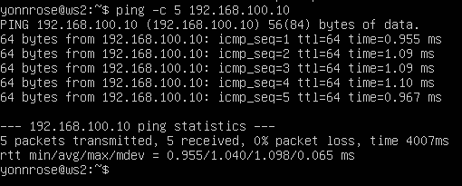

# Сети в Linux

Настройка сетей в Linux на виртуальных машинах.


## Contents

1. [Chapter I](#chapter-i)
2. [Chapter II](#chapter-ii) \
   2.1. [Стек протоколов TCP IP](#стек-протоколов-tcp-ip) \
   2.2. [Адресация](#адресация) \
   2.3. [Маршрутизация](#маршрутизация)
3. [Chapter III](#chapter-iii) \
   3.1. [Инструмент ipcalc](#part-1-инструмент-ipcalc) \
   3.2. [Статическая маршрутизация между двумя машинами](#part-2-статическая-маршрутизация-между-двумя-машинами) \
   3.3. [Утилита iperf3](#part-3-утилита-iperf3) \
   3.4. [Сетевой экран](#part-4-сетевой-экран) \
   3.5. [Статическая маршрутизация сети](#part-5-статическая-маршрутизация-сети) \
   3.6. [Динамическая настройка IP с помощью DHCP](#part-6-динамическая-настройка-ip-с-помощью-dhcp) \
   3.7. [NAT](#part-7-nat) \
   3.8. [Допополнительно. Знакомство с SSH Tunnels](#part-8-дополнительно-знакомство-с-ssh-tunnels)
4. [Chapter IV](#chapter-iv)


## Part 1. Инструмент **ipcalc**

**== Задание ==**

##### Подними виртуальную машину (далее -- ws1)

#### 1.1. Сети и маски
##### Определи и запиши в отчёт:
##### 1) Адрес сети *192.167.38.54/13*
##### 2) Перевод маски *255.255.255.0* в префиксную и двоичную запись, */15* в обычную и двоичную, *11111111.11111111.11111111.11110000* в обычную и префиксную
##### 3) Минимальный и максимальный хост в сети *12.167.38.4* при масках: */8*, *11111111.11111111.00000000.00000000*, *255.255.254.0* и */4*

#### 1.2. localhost
##### Определи и запиши в отчёт, можно ли обратиться к приложению, работающему на localhost, со следующими IP: *194.34.23.100*, *127.0.0.2*, *127.1.0.1*, *128.0.0.1*

#### 1.3. Диапазоны и сегменты сетей
##### Определи и запиши в отчёт:
##### 1) Какие из перечисленных IP можно использовать в качестве публичного, а какие только в качестве частных: *10.0.0.45*, *134.43.0.2*, *192.168.4.2*, *172.20.250.4*, *172.0.2.1*, *192.172.0.1*, *172.68.0.2*, *172.16.255.255*, *10.10.10.10*, *192.169.168.1*
##### 2) Какие из перечисленных IP адресов шлюза возможны у сети *10.10.0.0/18*: *10.0.0.1*, *10.10.0.2*, *10.10.10.10*, *10.10.100.1*, *10.10.1.255*

**== Выполнение задания ==**

Работа с виртуальной машиной ws1.

#### 1.1. Сети и маски
##### Определить и записать в отчёт:
##### 1) адрес сети *192.167.38.54/13*
Воспользовавшись командой ```ipcalc```, можно опеределить адрес сети в поле Address <br>


> *Сетевой адрес* — идентификатор устройства, работающего в компьютерной сети.
##### 2) перевод маски *255.255.255.0* в префиксную и двоичную запись, */15* в обычную и двоичную, *11111111.11111111.11111111.11110000* в обычную и префиксную

> Префиксная запись. Краткий формат записи маски подсети, в котором указывается только количество единичных битов в маске после косой черты.
- Префиксная запись маски *255.255.255.0* в поле Network: ```/24```
- Двоичная запись маски *255.255.255.0* в поле Netmask: ```11111111.11111111.11111111.00000000```


- */15* в обычной записи в поле Netmask: ```255.254.0.0```
- */15* в двоичной записи также в поле Netmask: ```1111111.11111110.00000000.00000000 ``` 


> Команда ```ipcalc``` не принимает маски в двоичной записи, поэтому переведем исходную маку *11111111.11111111.11111111.11110000* в обычную запись и получим *255.255.255.240*
- В обычной форме: ```255.255.255.240```
- В префиксной форме: ```/28``` <br>


##### 3) минимальный и максимальный хост в сети *12.167.38.4* при масках: */8*, *11111111.11111111.00000000.00000000*, *255.255.254.0* и */4*

- минимальный и максимальный хосты в сети *12.167.38.4* при масках:
    - */8* <br>
      - Минимальный хост сети: ```12.0.0.1```
      - Максимальный хост сети: ```12.255.255.254``` <br>
   

    - *11111111.11111111.00000000.00000000*
      - Минимальный хост сети: ```12.167.0.1```
      - Максимальный хост сети: ```12.167.255.254```<br>
   
    - *255.255.254.0*
      - Минимальный хост сети: ```12.167.38.1```
      - Максимальный хост сети: ```12.167.39.254```<br>
   
    - */4*
      - Минимальный хост сети: ```0.0.0.1```
      - Максимальный хост сети: ```15.255.255.254```<br>
   


#### 1.2. localhost
##### Определить и записать в отчёт, можно ли обратиться к приложению, работающему на localhost, со следующими IP: *194.34.23.100*, *127.0.0.2*, *127.1.0.1*, *128.0.0.1*

> Обратная петля *loopback* позволяет компьютеру связываться с самим собой, используя протоколы сетевых подключений.
- IP: *194.34.23.100* <br>


- IP: *127.0.0.2*<br>


- IP: *127.1.0.1*<br>


- IP: *128.0.0.1*<br>


Можно ли обратиться к приложению, работающему на localhost, со следующими IP:
   - 194.34.23.100 - нет
   - 127.0.0.2 - да
   - 127.1.0.1 - да
   - 128.0.0.1 - нет

#### 1.3. Диапазоны и сегменты сетей
##### 1) какие из перечисленных IP можно использовать в качестве публичного, а какие только в качестве частных: *10.0.0.45*, *134.43.0.2*, *192.168.4.2*, *172.20.250.4*, *172.0.2.1*, *192.172.0.1*, *172.68.0.2*, *172.16.255.255*, *10.10.10.10*, *192.169.168.1*

> Все IP-адреса протокола IPv4 делятся на публичные/глобальные/внешние (их называют "белые") — они используются в сети Интернет, и частные/локальные/внутренние (их называют "серые") — используются в локальной сети.

- Публичные IP:<br>


> К частным "серым" адресам относятся IP-адреса из следующих подсетей:
  От 10.0.0.0 до 10.255.255.255 с маской 255.0.0.0 или /8
  От 172.16.0.0 до 172.31.255.255 с маской 255.240.0.0 или /12
  От 192.168.0.0 до 192.168.255.255 с маской 255.255.0.0 или /16
  От 100.64.0.0 до 100.127.255.255 с маской подсети 255.192.0.0 или /10

> Это зарезервированные IP-адреса. Такие адреса предназначены для применения в закрытых локальных сетях, распределение таких адресов никем не контролируется.

- Частные IP: <br>


##### 2) какие из перечисленных IP адресов шлюза возможны у сети *10.10.0.0/18*: *10.0.0.1*, *10.10.0.2*, *10.10.10.10*, *10.10.100.1*, *10.10.1.255*


>  Диапазон возможных IP-адресов: **10.0.0.1 - 10.10.63.254**
  - Возможные адреса: 10.0.0.1, 10.10.0.2
  - Невозможные адреса: 10.10.10.10, 10.10.100.1, 10.10.1.255

## Part 2. Статическая маршрутизация между двумя машинами
**== Задание ==**

##### Подними две виртуальные машины (далее -- ws1 и ws2).

##### С помощью команды `ip a` посмотри существующие сетевые интерфейсы.
- В отчёт помести скрин с вызовом и выводом использованной команды.
##### Опиши сетевой интерфейс, соответствующий внутренней сети, на обеих машинах и задать следующие адреса и маски: ws1 - *192.168.100.10*, маска */16*, ws2 - *172.24.116.8*, маска */12*.
- В отчёт помести скрины с содержанием изменённого файла *etc/netplan/00-installer-config.yaml* для каждой машины.
##### Выполни команду `netplan apply` для перезапуска сервиса сети.
- В отчёт помести скрин с вызовом и выводом использованной команды.

#### 2.1. Добавление статического маршрута вручную
##### Добавь статический маршрут от одной машины до другой и обратно при помощи команды вида `ip r add`.
##### Пропингуй соединение между машинами.
- В отчёт помести скрин с вызовом и выводом использованных команд.

#### 2.2. Добавление статического маршрута с сохранением
##### Перезапусти машины.
##### Добавь статический маршрут от одной машины до другой с помощью файла *etc/netplan/00-installer-config.yaml*.
- В отчёт помести скрин с содержанием изменённого файла *etc/netplan/00-installer-config.yaml*.
##### Пропингуй соединение между машинами.
- В отчёт помести скрин с вызовом и выводом использованной команды.

**== Выполнение задания ==**

Работа с виртуальными машинами ws1 и ws2.

##### С помощью команды `ip a` посмотреть существующие сетевые интерфейсы


##### Описать сетевой интерфейс, соответствующий внутренней сети, на обеих машинах и задать следующие адреса и маски: ws1 - *192.168.100.10*, маска */16*, ws2 - *172.24.116.8*, маска */12*
- Содержимое файла *etc/netplan/00-installer-config.yaml* для ws1 <br>

- Содержимое файла *etc/netplan/00-installer-config.yaml* для ws2 <br>

##### Выполнить команду `netplan apply` для перезапуска сервиса сети <br>


Сетевые интерфейсы после выполнения команды: <br>


#### 2.1. Добавление статического маршрута вручную
##### Добавить статический маршрут от одной машины до другой и обратно при помощи команды вида `ip r add`
- ws1: <br>

- ws2: <br>


##### Пропинговать соединение между машинами
> Ping — утилита для проверки целостности и качества соединений в сетях на основе TCP/IP. <br>


#### 2.2. Добавление статического маршрута с сохранением
##### Перезапустить машины
- Перезапустим машины с помощью ```sudo reboot```

- Проверим, что после перезапуска статические маршруты были удалены <br>


##### Добавить статический маршрут от одной машины до другой с помощью файла *etc/netplan/00-installer-config.yaml*
- Добавим статические маршруты с помощью файла *etc/netplan/00-installer-config.yaml* <br>


- Проверим, что изменения в файле сохранены, и применим новую конфигурацию с помощью ```sudo netplan apply```
- C помощью ```ip r``` убедимся, что маршруты добавлены <br>


##### Пропинговать соединение между машинами
- Пропингуем соединение между машинами <br>




## Part 3. Утилита **iperf3**
**== Задание ==**

*В данном задании используются виртуальные машины ws1 и ws2 из Части 2*

#### 3.1. Скорость соединения
##### Переведи и запиши в отчёт: 8 Mbps в MB/s, 100 MB/s в Kbps, 1 Gbps в Mbps.

#### 3.2. Утилита **iperf3**
##### Измерь скорость соединения между ws1 и ws2.
- В отчёт помести скрины с вызовом и выводом использованных команд.

**== Выполнение задания ==**

*В данном задании используются виртуальные машины ws1 и ws2 из Части 2*

#### 3.1. Скорость соединения
##### Перевести и записать в отчёт: 8 Mbps в MB/s, 100 MB/s в Kbps, 1 Gbps в Mbps

- Перевод

| Исходное | Перевод | Пояснение |
| ------ | ------ | ------ |
| 8 Mbps | 1 MB/s |1 MB = 8 Mb|
| 100 MB/s | 800000 Kbps |1 MB = 8 * 10^3 Kb|
|1 Gbps|1000 Mbps|1 Gb = 10^3 Mb|

#### 3.2. Утилита **iperf3**
##### Измерить скорость соединения между ws1 и ws2
- Сначала необходимо запустить серверную часть программы. Для этого выполним на ws1 ```iperf3 -s```. Таким образом, был запущен сервер с адресом ```172.24.116.8```


- Подключимся к серверу с помощью ```iperf3 -c 172.24.116.8``` и получим информацию о скорости подключения


- Скорость передачи для sender (ws2): 3.43 Gbps
- Скорость передачи receiver (ws1): 3.42 Gbps

## Part 4. Сетевой экран

**== Задание ==**

*В данном задании используются виртуальные машины ws1 и ws2 из Части 2*

#### 4.1. Утилита **iptables**
##### Создай файл */etc/firewall.sh*, имитирующий фаерволл, на ws1 и ws2:
```shell
#!/bin/sh

# Удаление всех правил в таблице «filter» (по-умолчанию).
iptables -F
iptables -X
```
##### Нужно добавить в файл подряд следующие правила:
##### 1) На ws1 примени стратегию, когда в начале пишется запрещающее правило, а в конце пишется разрешающее правило (это касается пунктов 4 и 5).
##### 2) На ws2 примени стратегию, когда в начале пишется разрешающее правило, а в конце пишется запрещающее правило (это касается пунктов 4 и 5).
##### 3) Открой на машинах доступ для порта 22 (ssh) и порта 80 (http).
##### 4) Запрети *echo reply* (машина не должна «пинговаться», т.е. должна быть блокировка на OUTPUT).
##### 5) Разреши *echo reply* (машина должна «пинговаться»).
- В отчёт помести скрины с содержанием файла */etc/firewall* для каждой машины.
##### Запусти файлы на обеих машинах командами `chmod +x /etc/firewall.sh` и `/etc/firewall.sh`.
- В отчёт помести скрины с запуском обоих файлов;
- В отчёте опиши разницу между стратегиями, применёнными в первом и втором файлах.

#### 4.2. Утилита **nmap**
##### Командой **ping** найди машину, которая не «пингуется», после чего утилитой **nmap** покажи, что хост машины запущен.
*Проверка: в выводе nmap должно быть сказано: `Host is up`*.
- В отчёт помести скрины с вызовом и выводом использованных команд **ping** и **nmap**.

**== Выполнение задания ==**

> Сетевой экран – это своего рода управляемый барьер или шлюз, который контролирует разрешенную и запрещенную веб-активность в частной сети.

*В данном задании используются виртуальные машины ws1 и ws2 из Части 2*

#### 4.1. Утилита **iptables**
##### Создать файл */etc/firewall.sh*, имитирующий фаерволл, на ws1 и ws2:
```shell
#!/bin/sh

# Удаление всех правил в таблице "filter" (по-умолчанию).
iptables –F
iptables -X
```
##### Нужно добавить в файл подряд следующие правила:
##### 1) на ws1 применить стратегию когда в начале пишется запрещающее правило, а в конце пишется разрешающее правило (это касается пунктов 4 и 5)
##### 2) на ws2 применить стратегию когда в начале пишется разрешающее правило, а в конце пишется запрещающее правило (это касается пунктов 4 и 5)
##### 3) открыть на машинах доступ для порта 22 (ssh) и порта 80 (http)
##### 4) запретить *echo reply* (машина не должна "пинговаться”, т.е. должна быть блокировка на OUTPUT)
##### 5) разрешить *echo reply* (машина должна "пинговаться")

- Создадим файл ```/etc/firewall.sh``` и применим правила:


> Здесь:
>  - -A - добавить новое правило в цепочку
>  - -p - протокол tcp
>  - ACCEPT - разрешить
>  - DROP - запретить

##### Запустить файлы на обеих машинах командами `chmod +x /etc/firewall.sh` и `/etc/firewall.sh`

- Запустим файлы на обеих машинах командами ```sudo chmod +x /etc/firewall.sh``` и ```sudo sh /etc/firewall.sh```
- С помощью ```iptables -L``` рассмотрим, как выполняется просмотр правил


- Опишем разницу между стратегиями, применёнными в первом и втором файлах
> В файлах ```/etc/firewall.sh``` был использован флаг
```-j``` - выбрать действие, если правило подошло. <br>
> Таким образом, при обработке правил сверху-вниз при совпадении описанных условий применяется то правило, что расположено выше. <br>
> Из-за того, что в файле ws1 запрещающее правило находится выше разрешающего, виртуальная машина 1 не может пропинговать виртуальную машину 2. <br>
> Для виртуальной машины 2 ситуация противоположная, поскольку разрешающее правило выше запрещающего.

#### 4.2. Утилита **nmap**
##### Командой **ping** найти машину, которая не "пингуется", после чего утилитой **nmap** показать, что хост машины запущен
*Проверка: в выводе nmap должно быть сказано: `Host is up`*

- Проверим, пингуются ли машины


> Поскольку на ws1 задана блокировка на OUTPUT, PING с нее невозможен, что видно по первому рисунку. В то же время ws2 пингуется.

- Утилитой ```nmap``` посмотрим, что хосты машин запущены.


## Part 5. Статическая маршрутизация сети

**== Задание ==**

Сеть: \

##### Подними пять виртуальных машин (3 рабочие станции (ws11, ws21, ws22) и 2 роутера (r1, r2)).

#### 5.1. Настройка адресов машин
##### Настрой конфигурации машин в *etc/netplan/00-installer-config.yaml* согласно сети на рисунке.
- В отчёт помести скрины с содержанием файла *etc/netplan/00-installer-config.yaml* для каждой машины.
##### Перезапусти сервис сети. Если ошибок нет, то командой `ip -4 a` проверь, что адрес машины задан верно. Также пропингуй ws22 с ws21. Аналогично пропингуй r1 с ws11.
- В отчёт помести скрины с вызовом и выводом использованных команд.

#### 5.2. Включение переадресации IP-адресов
##### Для включения переадресации IP, выполни команду на роутерах:
`sysctl -w net.ipv4.ip_forward=1`
*При таком подходе переадресация не будет работать после перезагрузки системы.*
- В отчёт помести скрин с вызовом и выводом использованной команды.
##### Открой файл */etc/sysctl.conf* и добавь в него следующую строку:
`net.ipv4.ip_forward = 1`
*При использовании этого подхода, IP-переадресация включена на постоянной основе.*
- В отчёт помести скрин с содержанием изменённого файла */etc/sysctl.conf*.

#### 5.3. Установка маршрута по-умолчанию
Пример вывода команды `ip r` после добавления шлюза:
```
default via 10.10.0.1 dev eth0
10.10.0.0/18 dev eth0 proto kernel scope link src 10.10.0.2
```
##### Настрой маршрут по-умолчанию (шлюз) для рабочих станций. Для этого добавь `default` перед IP роутера в файле конфигураций.
- В отчёт помести скрин с содержанием файла *etc/netplan/00-installer-config.yaml*;
##### Вызови `ip r` и покажи, что добавился маршрут в таблицу маршрутизации.
- В отчёт помести скрин с вызовом и выводом использованной команды.
##### Пропингуй с ws11 роутер r2 и покажи на r2, что пинг доходит. Для этого используй команду:
`tcpdump -tn -i eth0`
- В отчёт помести скрин с вызовом и выводом использованных команд.

#### 5.4. Добавление статических маршрутов
##### Добавь в роутеры r1 и r2 статические маршруты в файле конфигураций. Пример для r1 маршрута в сетку 10.20.0.0/26:
```shell
# Добавь в конец описания сетевого интерфейса eth1:
- to: 10.20.0.0
  via: 10.100.0.12
```
- В отчёт помести скрины с содержанием изменённого файла *etc/netplan/00-installer-config.yaml* для каждого роутера.
##### Вызови `ip r` и покажи таблицы с маршрутами на обоих роутерах. Пример таблицы на r1:
```
10.100.0.0/16 dev eth1 proto kernel scope link src 10.100.0.11
10.20.0.0/26 via 10.100.0.12 dev eth1
10.10.0.0/18 dev eth0 proto kernel scope link src 10.10.0.1
```
- В отчёт помести скрин с вызовом и выводом использованной команды.
##### Запусти команды на ws11:
`ip r list 10.10.0.0/[маска сети]` и `ip r list 0.0.0.0/0`
- В отчёт помести скрин с вызовом и выводом использованных команд;
- В отчёте объясни, почему для адреса 10.10.0.0/\[маска сети\] был выбран маршрут, отличный от 0.0.0.0/0, хотя он попадает под маршрут по-умолчанию.

#### 5.5. Построение списка маршрутизаторов
Пример вывода утилиты **traceroute** после добавления шлюза:
```
1 10.10.0.1 0 ms 1 ms 0 ms
2 10.100.0.12 1 ms 0 ms 1 ms
3 10.20.0.10 12 ms 1 ms 3 ms
```
##### Запусти на r1 команду дампа:
`tcpdump -tnv -i eth0`
##### При помощи утилиты **traceroute** построй список маршрутизаторов на пути от ws11 до ws21.
- В отчёт помести скрины с вызовом и выводом использованных команд (tcpdump и traceroute);
- В отчёте, опираясь на вывод, полученный из дампа на r1, объясни принцип работы построения пути при помощи **traceroute**.

#### 5.6. Использование протокола **ICMP** при маршрутизации
##### Запусти на r1 перехват сетевого трафика, проходящего через eth0 с помощью команды:
`tcpdump -n -i eth0 icmp`
##### Пропингуй с ws11 несуществующий IP (например, *10.30.0.111*) с помощью команды:
`ping -c 1 10.30.0.111`
- В отчёт помести скрин с вызовом и выводом использованных команд.

**== Выполнение задания ==**

Сеть: \


##### Поднять пять виртуальных машин (3 рабочие станции (ws11, ws21, ws22) и 2 роутера (r1, r2))

#### 5.1. Настройка адресов машин

Содержание файла *etc/netplan/00-installer-config.yaml* для каждой машины:


Перезапуск сервиса сети и проверка адреса машин (`ip -4 a`):


Пропингуем ws22 с ws21:


Пропингуем r1 с ws11:


#### 5.2. Включение переадресации IP-адресов

Включение переадресации IP на роутерах с помощью команды `sysctl -w net.ipv4.ip_forward=1`:


Файл */etc/sysctl.conf* с добавленной строкой `net.ipv4.ip_forward = 1`:


#### 5.3. Установка маршрута по умолчанию

Добавим gateway4 [ip роутера] в файлы конфигураций рабочих станций, перезапустим сервис сети и вызовем команду `ip r`:


Пропингуем с ws11 роутер r2 и покажем на r2, что пинг доходит с помощью команды `tcpdump -tn -i enp0s8`:


#### 5.4. Добавление статических маршрутов

Добавим в роутеры r1 и r2 статические маршруты в файле конфигураций, перезапустим сервис сети и вызовем команду `ip r`:


Вызов команд `ip r list 10.10.0.0/[маска сети]` и `ip r list 0.0.0.0/0` на ws11:


Для адреса 10.10.0.0/18 был выбран маршрут, отличный от 0.0.0.0/0, поскольку он является адресом сети и доступен без шлюза.

#### 5.5. Построение списка маршрутизаторов

Запуск на r1 команды дампа `tcpdump -tnv -i ent0` и построение списка маршрутизаторов на пути от ws11 до ws21 при помощи утилиты traceroute:


Для определения промежуточных маршрутизаторов traceroute отправляет целевому узлу серию ICMP-пакетов (по умолчанию 3 пакета), с каждым шагом увеличивая значение поля TTL («время жизни») на 1. Это поле обычно указывает максимальное количество маршрутизаторов, которое может быть пройдено пакетом. Первая серия пакетов отправляется с TTL, равным 1, и поэтому первый же маршрутизатор возвращает обратно ICMP-сообщение «time exceeded in transit», указывающее на невозможность доставки данных. Traceroute фиксирует адрес маршрутизатора, а также время между отправкой пакета и получением ответа (эти сведения выводятся на монитор компьютера). Затем traceroute повторяет отправку серии пакетов, но уже с TTL, равным 2, что заставляет первый маршрутизатор уменьшить TTL пакетов на единицу и направить их ко второму маршрутизатору. Второй маршрутизатор, получив пакеты с TTL=1, так же возвращает «time exceeded in transit».

Процесс повторяется до тех пор, пока пакет не достигнет целевого узла. При получении ответа от этого узла процесс трассировки считается завершённым.

На оконечном хосте IP-датаграмма с TTL = 1 не отбрасывается и не вызывает ICMP-сообщения типа срок истёк, а должна быть отдана приложению. Достижение пункта назначения определяется следующим образом: отсылаемые traceroute датаграммы содержат UDP-пакет с заведомо неиспользуемым номером порта на адресуемом хосте. Номер порта будет равен 33434 + (максимальное количество транзитных участков до узла) — 1. В пункте назначения UDP-модуль, получая подобные датаграммы, возвращает ICMP-сообщения об ошибке «порт недоступен». Таким образом, чтобы узнать о завершении работы, программе traceroute достаточно обнаружить, что поступило ICMP-сообщение об ошибке этого типа

#### 5.6. Использование протокола **ICMP** при маршрутизации

Запуск на r1 перехвата сетевого трафика, проходящего через eth0 с помощью команды `tcpdump -n -i eth0 icmp` и пинг с ws11 несуществующего IP `ping -c 1 10.30.0.111`:


## Part 6. Динамическая настройка IP с помощью **DHCP**

**== Задание ==**

*В данном задании используются виртуальные машины из Части 5.*

##### Для r2 настрой в файле */etc/dhcp/dhcpd.conf* конфигурацию службы **DHCP**:
##### 1) Укажи адрес маршрутизатора по-умолчанию, DNS-сервер и адрес внутренней сети. Пример файла для r2:
```shell
subnet 10.100.0.0 netmask 255.255.0.0 {}

subnet 10.20.0.0 netmask 255.255.255.192
{
    range 10.20.0.2 10.20.0.50;
    option routers 10.20.0.1;
    option domain-name-servers 10.20.0.1;
}
```
##### 2) В файле *resolv.conf* пропиши `nameserver 8.8.8.8`.
- В отчёт помести скрины с содержанием изменённых файлов.
##### Перезагрузи службу **DHCP** командой `systemctl restart isc-dhcp-server`. Машину ws21 перезагрузи при помощи `reboot` и через `ip a` покажи, что она получила адрес. Также пропингуй ws22 с ws21.
- В отчёт помести скрины с вызовом и выводом использованных команд.

##### Укажи MAC адрес у ws11, для этого в *etc/netplan/00-installer-config.yaml* надо добавить строки: `macaddress: 10:10:10:10:10:BA`, `dhcp4: true`.
- В отчёт помести скрин с содержанием изменённого файла *etc/netplan/00-installer-config.yaml*.
##### Для r1 настрой аналогично r2, но сделай выдачу адресов с жесткой привязкой к MAC-адресу (ws11). Проведи аналогичные тесты.
- В отчёте этот пункт опиши аналогично настройке для r2.
##### Запроси с ws21 обновление ip адреса.
- В отчёте помести скрины ip до и после обновления.
- В отчёте опиши, какими опциями **DHCP** сервера пользовался в данном пункте.

**== Выполнение задания ==**

1. Содержание файла */etc/dhcp/dhcpd.conf* для r2 с конфигурацией службы **DHCP**:


Содержание файла *resolv.conf* с `nameserver 8.8.8.8.`:


2. Перезагрузка службы **DHCP** командой `systemctl restart isc-dhcp-server`:


Перезагружаем машину ws21 при помощи `reboot` и через `ip a` покажем, что она получила адрес:


Пинг ws22 с ws21:


3. Cодержание файла *etc/netplan/00-installer-config.yaml* для ws11 с добавленным MAC адресом:


4. Аналогичная настройка r1 (с жесткой привязкой к MAC адресу)

Конфигурация DHCP:


DNS:


Перезагрузка службы DHCP:


5. Запрос обновления ip адреса с ws21

ip до обновления:


ip после обновления:


Команда `sudo dhclient -r enp0s8` освобождает текущий адрес интерфейса enp0s8.
Команда `sudo dhclient enp0s8` задает новый адрес указанному интерфейсу.

## Part 7. **NAT**

**== Задание ==**

*В данном задании используются виртуальные машины из Части 5*
##### В файле */etc/apache2/ports.conf* на ws22 и r1 изменить строку `Listen 80` на `Listen 0.0.0.0:80`, то есть сделать сервер Apache2 общедоступным
- В отчёт поместить скрин с содержанием изменённого файла.
##### Запустить веб-сервер Apache командой `service apache2 start` на ws22 и r1
- В отчёт поместить скрины с вызовом и выводом использованной команды.
##### Добавить в фаервол, созданный по аналогии с фаерволом из Части 4, на r2 следующие правила:
##### 1) удаление правил в таблице filter - `iptables -F`
##### 2) удаление правил в таблице "NAT" - `iptables -F -t nat`
##### 3) отбрасывать все маршрутизируемые пакеты - `iptables --policy FORWARD DROP`
##### Запускать файл также, как в Части 4
##### Проверить соединение между ws22 и r1 командой `ping`
*При запуске файла с этими правилами, ws22 не должна "пинговаться" с r1*
- В отчёт поместить скрины с вызовом и выводом использованной команды.
##### Добавить в файл ещё одно правило:
##### 4) разрешить маршрутизацию всех пакетов протокола **ICMP**
##### Запускать файл также, как в Части 4
##### Проверить соединение между ws22 и r1 командой `ping`
*При запуске файла с этими правилами, ws22 должна "пинговаться" с r1*
- В отчёт поместить скрины с вызовом и выводом использованной команды.
##### Добавить в файл ещё два правила:
##### 5) включить **SNAT**, а именно маскирование всех локальных ip из локальной сети, находящейся за r2 (по обозначениям из Части 5 - сеть 10.20.0.0)
*Совет: стоит подумать о маршрутизации внутренних пакетов, а также внешних пакетов с установленным соединением*
##### 6) включить **DNAT** на 8080 порт машины r2 и добавить к веб-серверу Apache, запущенному на ws22, доступ извне сети
*Совет: стоит учесть, что при попытке подключения возникнет новое tcp-соединение, предназначенное ws22 и 80 порту*
- В отчёт поместить скрин с содержанием изменённого файла.
##### Запускать файл также, как в Части 4
*Перед тестированием рекомендуется отключить сетевой интерфейс **NAT** (его наличие можно проверить командой `ip a`) в VirtualBox, если он включен*
##### Проверить соединение по TCP для **SNAT**, для этого с ws22 подключиться к серверу Apache на r1 командой:
`telnet [адрес] [порт]`
##### Проверить соединение по TCP для **DNAT**, для этого с r1 подключиться к серверу Apache на ws22 командой `telnet` (обращаться по адресу r2 и порту 8080)
- В отчёт поместить скрины с вызовом и выводом использованных команд.

**== Выполнение задания ==**

1. Содержание файла */etc/apache2/ports.conf* на ws22 и r2 (строка `Listen 80` изменена на `Listen 0.0.0.0:80`):


2. Запуск веб-сервера Apache командой `service apache2 start` на ws22 и r1:


3. Добавление в фаервол на r2 следующих правил:
1) Удаление правил в таблице filter - `iptables -F`
2) Удаление правил в таблице "NAT" - `iptables -F -t nat`
3) Отбрасывать все маршрутизируемые пакеты - `iptables --policy FORWARD DROP`

Добавление правил и запуск фаервола:


Проверка соединения между ws22 и r1 командой ping (Пинг с ws22 до r1 не удаётся):


4) Разрешим маршрутизацию всех пакетов протокола **ICMP**:


Проверка соединения между ws22 и r1 командой ping:


5) Включить **SNAT**, а именно маскирование всех локальных ip из локальной сети, находящейся за r2 (сеть 10.20.0.0)

6) Включить **DNAT** на 8080 порт машины r2 и добавить к веб-серверу Apache, запущенному на ws22, доступ извне сети


Проверка соединения по TCP для **SNAT**, для этого с ws22 подключиться к серверу Apache на r1 командой `telnet [адрес] [порт]`:


Проверка соединения по TCP для **DNAT**, для этого с r1 подключиться к серверу Apache на ws22 командой `telnet` (обращаться по адресу r2 и порту 8080):


## Part 8. Дополнительно. Знакомство с **SSH Tunnels**

**== Задание ==**

*В данном задании используются виртуальные машины из Части 5*

##### Запустить на r2 фаервол с правилами из Части 7
##### Запустить веб-сервер **Apache** на ws22 только на localhost (то есть в файле */etc/apache2/ports.conf* изменить строку `Listen 80` на `Listen localhost:80`)
##### Воспользоваться *Local TCP forwarding* с ws21 до ws22, чтобы получить доступ к веб-серверу на ws22 с ws21
##### Воспользоваться *Remote TCP forwarding* c ws11 до ws22, чтобы получить доступ к веб-серверу на ws22 с ws11
##### Для проверки, сработало ли подключение в обоих предыдущих пунктах, перейдите во второй терминал (например, клавишами Alt + F2) и выполните команду:
`telnet 127.0.0.1 [локальный порт]`
- В отчёте описать команды, необходимые для выполнения этих четырёх пунктов, а также приложить скриншоты с их вызовом и выводом.

**== Выполнение задания ==**

- Запустить на r2 фаервол с правилами из Части 7


- Запустить веб-сервер **Apache** на ws22 только на localhost (то есть в файле /etc/apache2/ports.conf изменить строку Listen 80 на Listen localhost:80)


- Воспользоваться *Local TCP forwarding* с ws21 до ws22, чтобы получить доступ к веб-серверу на ws22 с ws21:


Для *Local TCP forwarding* применяется команда ssh -L local_port:destination:destination_port ssh_server_ip

Проверка подключения:


- Воспользоваться *Remote TCP forwarding* c ws11 до ws22, чтобы получить доступ к веб-серверу на ws22 с ws11:


Для *Remote TCP forwarding* применяется команда ssh -R remote_port:destination:destination_port ssh_server_ip

Проверка подключения:

