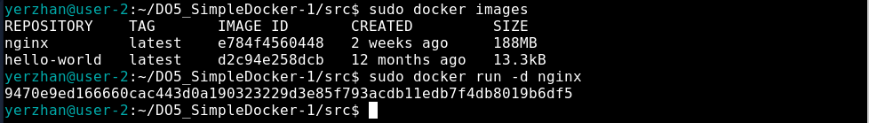
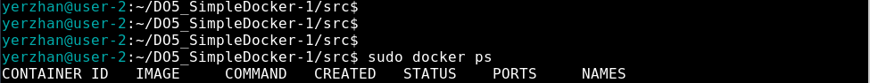
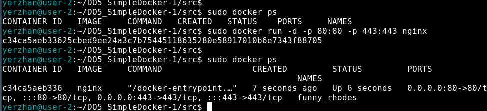
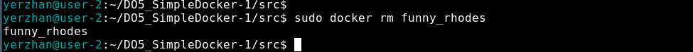
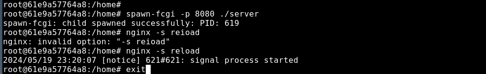

# S21_SimpleDocker

## Part1. Готовый докер

**== Задание ==**

##### Возьми официальный докер-образ с **nginx** и выкачай его при помощи `docker pull`.
##### Проверь наличие докер-образа через `docker images`.
##### Запусти докер-образ через `docker run -d [image_id|repository]`.
##### Проверь, что образ запустился через `docker ps`.
##### Посмотри информацию о контейнере через `docker inspect [container_id|container_name]`.
##### По выводу команды определи и помести в отчёт размер контейнера, список замапленных портов и ip контейнера.
##### Останови докер образ через `docker stop [container_id|container_name]`.
##### Проверь, что образ остановился через `docker ps`.
##### Запусти докер с портами 80 и 443 в контейнере, замапленными на такие же порты на локальной машине, через команду *run*.
##### Проверь, что в браузере по адресу *localhost:80* доступна стартовая страница **nginx**.
##### Перезапусти докер контейнер через `docker restart [container_id|container_name]`.
##### Проверь любым способом, что контейнер запустился.

- В отчёт помести скрины:
  - вызова и вывода всех использованных в этой части задания команд;
  - стартовой страницы **nginx** по адресу *localhost:80* (адрес должен быть виден).
  
*Замечание:* **Не загружай тяжелые файлы (>10 мб) в гит.**

**== Выполнение задания ==**

* Возьмемо официальный docker-образ с nginx и выкачаем его при помощи команды `docker pull` 

* Далее удостоверимся в наличии образа через команду `docker images` 

* Наконец, запустим docker-образ через команду `docker run -d [image_id|repository]` 

  -d: это флаг, который указывает Docker на запуск контейнера в фоновом режиме (detached mode). Это означает, что контейнер будет работать в фоновом режиме, и командная строка будет освобождена для дальнейшего использования.

* Удостоверимся, что контейнер успешно запустился через команду `docker ps` 

* Теперь посмотрим информацию о контейнере через команду `docker inspect [container_id|container_name]` 

* Выведем размер контейнера  

* А теперь - список замапленных портов  

* И, наконец, IP контейнера  

* Остановим docker-образ командой `docker stop [container_id|container_name]` и проверим, что образ успешно остановился через уже знакомую команду `docker ps` 

* Теперь запустим docker-образ с портами 80:80 и 443:443 чере команду `docker run` 

* Удостоверимся, что все работает, открыв в браузере страницу по адресу `localhost` 

* Наконец, перезапустим контейнер через команду `docker restart [container_id|container_name]` и проверим, что контейнер снова запустился командой `docker ps` 

# Part2. Операции с контейнером

Докер-образ и контейнер готовы. Теперь можно покопаться в конфигурации **nginx** и отобразить статус страницы.

**== Задание ==**

##### Прочитай конфигурационный файл *nginx.conf* внутри докер контейнера через команду *exec*.
##### Создай на локальной машине файл *nginx.conf*.
##### Настрой в нем по пути */status* отдачу страницы статуса сервера **nginx**.
##### Скопируй созданный файл *nginx.conf* внутрь докер-образа через команду `docker cp`.
##### Перезапусти **nginx** внутри докер-образа через команду *exec*.
##### Проверь, что по адресу *localhost:80/status* отдается страничка со статусом сервера **nginx**.
##### Экспортируй контейнер в файл *container.tar* через команду *export*.
##### Останови контейнер.
##### Удали образ через `docker rmi [image_id|repository]`, не удаляя перед этим контейнеры.
##### Удали остановленный контейнер.
##### Импортируй контейнер обратно через команду *import*.
##### Запусти импортированный контейнер.
##### Проверь, что по адресу *localhost:80/status* отдается страничка со статусом сервера **nginx**.

- В отчёт помести скрины:
  - вызова и вывода всех использованных в этой части задания команд;
  - содержимое созданного файла *nginx.conf*;
  - страницы со статусом сервера **nginx** по адресу *localhost:80/status*.

**== Выполнение задания ==**

* Для начала прочтем конфигурационный файл `nginx.conf` внутри docker-контейнера через команду `docker exec` 

* Теперь создадим локальный файл `nginx.conf` при помощи команды `touch nginx.conf` и настроем в нем выдачу страницы-статуса сервера по пути `/status` 

* Наконец, перенесем созданный файл внутрь docker-образа командой `docker cp` 

* И перезапустим nginx внутри docker-образа командой `docker exec [container_id|container_name] nginx -s reload` 

* Убедимся, что все работает, проверив страницу по адресу `localhost/status` 

* Теперь экспортируем наш контейнер в файл `container.tar` командой `docker export` 

* Затем удалим образ командой `docker rmi -f [image_id|repository]`, не удаляя перед этим контейнеры 

* После чего удалим остановленный контейнер командой `docker rm [container_id|container_name]` 

* Теперь импортируем контейнер обратно командой `docker import` и запустим импортированный контейнер уже знакомой командой `dicker run` 

* Наконец проверим, что по адресу `localhost/status` выдается страничка со статусом сервера nginx 

## Part3. Мини веб-сервер

Теперь стоит немного оторваться от докера, чтобы подготовиться к последнему этапу. Время написать свой сервер.

**== Задание ==**

##### Напиши мини-сервер на **C** и **FastCgi**, который будет возвращать простейшую страничку с надписью `Hello World!`.
##### Запусти написанный мини-сервер через *spawn-fcgi* на порту 8080.
##### Напиши свой *nginx.conf*, который будет проксировать все запросы с 81 порта на *127.0.0.1:8080*.
##### Проверь, что в браузере по *localhost:81* отдается написанная тобой страничка.
##### Положи файл *nginx.conf* по пути *./nginx/nginx.conf* (это понадобится позже).

**== Выполнение задания ==**

* Чтобы создать свой мини веб-сервер, необходимо создать .c файл, в котором будет описана логика сервера (в нашем случае - вывод сообщения `Hello World!`), а также конфиг `nginx.conf`, который будет проксировать все запросы с порта 81 на порт 127.0.0.1:8080 

* Теперь выкачаем новый docker-образ и на его основе запустим новый контейнер 

* После перекинем конфиг и логику сервера в новый контейнер 

* Затем установим требуемые утилиты для запуска мини веб-сервера на FastCGI, в частности `spawn-fcgi` и `libfcgi-dev` 

* Наконец скомпилируем и запустим наш мини веб-сервер через команду `spawn-fcgi` на порту 8080 

* Чтобы удостовериться, что все работает корректно, проверим, что в браузере по адресу `localhost:81` отдается написанная нами страница 

  *Примечание**

  *Если во время развертывания сервера в контейнере у вас возникнут непредвиденные ошибки, например, неправильно написанный конфиг или что-то вроде, из-за чего сервер будет работать некорректно, вам придется убить старый процесс при помощи команды [kill] по его PID, узнать который можно благодаря утилите [sockstat] командой [sockstat -lu], что показано на приведенном ниже скриншоте. После описанных манипуляций вы сможете вновь развернуть сервер на необходимый порт*

## Part4. Your own docker

Свой докер

Теперь всё готово. Можно приступать к написанию докер-образа для созданного сервера.

**== Задание ==**

*При написании докер-образа избегай множественных вызовов команд RUN*

#### Напиши свой докер-образ, который:
##### 1) собирает исходники мини сервера на FastCgi из [Части 3](#part-3-мини-веб-сервер);
##### 2) запускает его на 8080 порту;
##### 3) копирует внутрь образа написанный *./nginx/nginx.conf*;
##### 4) запускает **nginx**.
_**nginx** можно установить внутрь докера самостоятельно, а можно воспользоваться готовым образом с **nginx**'ом, как базовым._

##### Собери написанный докер-образ через `docker build` при этом указав имя и тег.
##### Проверь через `docker images`, что все собралось корректно.
##### Запусти собранный докер-образ с маппингом 81 порта на 80 на локальной машине и маппингом папки *./nginx* внутрь контейнера по адресу, где лежат конфигурационные файлы **nginx**'а (см. [Часть 2](#part-2-операции-с-контейнером)).
##### Проверь, что по localhost:80 доступна страничка написанного мини сервера.
##### Допиши в *./nginx/nginx.conf* проксирование странички */status*, по которой надо отдавать статус сервера **nginx**.
##### Перезапусти докер-образ.
*Если всё сделано верно, то, после сохранения файла и перезапуска контейнера, конфигурационный файл внутри докер-образа должен обновиться самостоятельно без лишних действий*
##### Проверь, что теперь по *localhost:80/status* отдается страничка со статусом **nginx**

**== Выполнение задания ==**

* Напишем свой docker-образ, который собирает исходники 3-й части, запускает на порту `80`, после копирует внутрь написанный нами `nginx.conf` и, наконец, запускает `nginx` (ниже приведены файлы `run.sh` и `Dockerfile`, файлы `nginx.conf` и `server.c` остаются с 3-й части)

 

  

* Соберем написанный docker-образ через команду `docker build`, при этом указав имя и тэг нашего контейнера  

   

* Теперь удостоверимся, что все собралось, проверив наличие соответствующего образа командой `docker images`  

   

* После запустим собранный docker-образ с мапингом порта `81` на порт `80` локальной машины, а также мапингом папки `./nginx` внутрь контейнера по адресу конфигурационных файлов nginx'а, и проверим, что страничка написанного сервера по адресу 

 

  *Примечание**
  *Если при проверке адреса localhost вы увидете ошибку 502, остановите запущенный docker-образ, после исправьте ошибки в конфигурационных файлах и заново запустите собранный docker-образ*

* Теперь добавим в файл `nginx.conf` проксирование странички `/status`, по которой необходимо отдавать статус сервера `nginx  

 

* Теперь перезапустим `nginx` в своем docker-образе командой `nginx -s reload`  

* Наконец, проверим, что по адресу `localhost/status` выдается страничка со статусом сервера `nginx`  

## Part5. **Dockle**

После написания образа никогда не будет лишним проверить его на безопасность.

**== Задание ==**

##### Просканируй образ из предыдущего задания через `dockle [image_id|repository]`.
##### Исправь образ так, чтобы при проверке через **dockle** не было ошибок и предупреждений.

**== Выполнение задания ==**

  *Примечание**
  *Перед выполнением данного шага необходимо установить утилиту [dockle], инструкция по установке [https://github.com/goodwithtech/dockle], если машина не видит утилиту [https://github.com/aquasecurity/trivy/issues/2432], также рекомендую добавить своего пользователя в группу [docker]*

* Просканируем docker-образ из предыдущего задания на предмет наличия ошибок командой `dockle [image_id|repository]`  

* Далее исправим конфигурационные файлы docker-образа так, чтобы при проверке через утилиту `dockle` не возникало ошибок и предупреждений (для Part5 я создал отдельный контейнер с тэгом `mmago`, куда подгрузил измененные конфиги)  

## Part6. Базовый **Docker Compose**

Вот ты и закончил свою разминку. А хотя погоди...
Почему бы не поэкспериментировать с развёртыванием проекта, состоящего сразу из нескольких докер-образов?

**== Задание ==**

##### Напиши файл *docker-compose.yml*, с помощью которого:
##### 1) Подними докер-контейнер из [Части 5](#part-5-инструмент-dockle) _(он должен работать в локальной сети, т.е. не нужно использовать инструкцию **EXPOSE** и мапить порты на локальную машину)_.
##### 2) Подними докер-контейнер с **nginx**, который будет проксировать все запросы с 8080 порта на 81 порт первого контейнера.
##### Замапь 8080 порт второго контейнера на 80 порт локальной машины.

##### Останови все запущенные контейнеры.
##### Собери и запусти проект с помощью команд `docker-compose build` и `docker-compose up`.
##### Проверь, что в браузере по *localhost:80* отдается написанная тобой страничка, как и ранее.

**== Выполнение задания ==**

  *Примечание**
  *Перед выполнением данного шага необходимо установить утилиту [docker-compose], инструкция по установке [https://www.digitalocean.com/community/tutorials/how-to-install-and-use-docker-compose-on-ubuntu-20-04]*

* Для начала остановим все запущенные контейнеры командой `docker stop`  

* Затем изменим конфигурационные файлы (их можно найти в папке `src/part6`)

* Теперь сбилдим контейнер командой `docker-compose build`

  

* После необходимо поднять сбилженный контейнер командой `docker compose up`

  

* В завершение насладимся плодами своей усердной работы, удостоверившись, что по адресу `localhost` отдается страничка с надписью `Hello World!`

