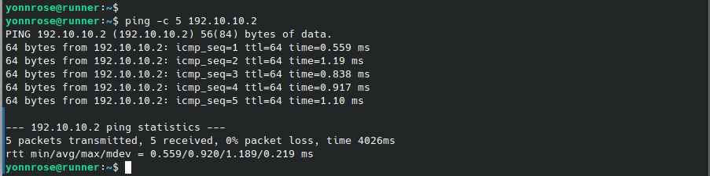
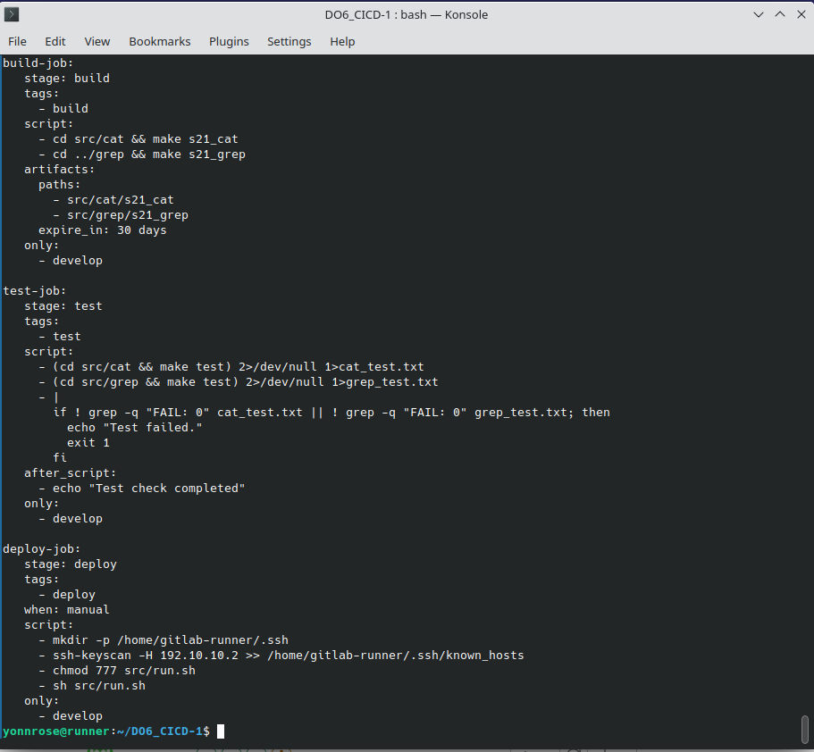
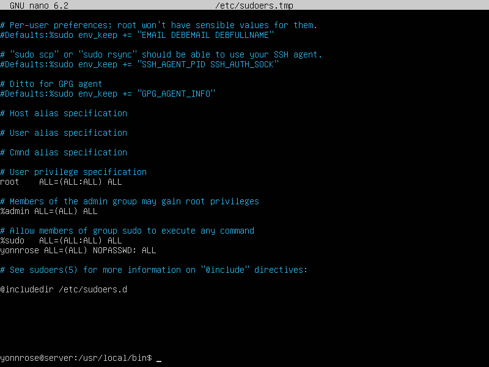

# Basic CI/CD

Разработка простого **CI/CD** для проекта *SimpleBashUtils*. Сборка, тестирование, развертывание.

<br>

## Содержание

1. [Настройка gitlab-runner](#part-1-настройка-gitlab-runner) \
  1.1. [Установка виртуальной машины](#поднять-виртуальную-машину-ubuntu-server-2204-lts) \
  1.2. [Установка gitlab-runner](#скачать-и-установить-на-виртуальную-машину-gitlab-runner) \
  1.3. [Регистрация в gitlab-runner](#запустить-gitlab-runner-и-зарегистрировать-его-для-использования-в-текущем-проекте-do6_cicd)
2. [Cборка](#part-2-сборка) \
  2.1. [Добавление этапа сборки](#напиcать-этап-для-ci-по-сборке-приложений-из-проекта-c2_simplebashutils) \
  2.2. [Неподготовленная оболочка](#неподготовленная-оболочка) \
  2.3. [Проверка сборки проекта](#проверка-сборки-проекта)
3. [Тест кодстайла](#part-3-тест-кодстайла) \
  3.1. [Добавление этапа теста кодстайла](#напиcать-этап-для-ci-который-запускает-скрипт-кодстайла-clang-format) \
  3.2. [Ошибочный вывод пайплайна](#проверить-зафейлился-ли-пайплайн-если-совершена-ошибка-в-кодстайле) \
  3.3. [Корректный вывод пайплайна](#исправить-ошибку-в-форматировании-кода-и-проверить-результат)
4. [Интеграционные тесты](#part-4-интеграционные-тесты) \
  4.1. [Добавление этапа интеграционных тестов](#написать-этап-для-ci-который-запускает-интеграционные-тесты-из-того-же-проекта) \
  4.2. [Ошибочный вывод пайплайна](#проверить-зафейлился-ли-пайплайн-если-обнаруживаются-ошибочные-рузльтаты-интеграционных-тестов) \
  4.3. [Корректный вывод пайплайна](#исправить-ошибку-для-успешного-прохождения-тестов-и-проверить-результат)
5. [Этап деплоя](#part-5-этап-деплоя) \
  5.1. [Установка виртуальной машины](#поднять-вторую-виртуальную-машину-ubuntu-server-2204-lts) \
  5.2. [Статическая маршрутизация между двумя машинами](#статическая-маршрутизация-между-двумя-машинами) \
  5.3. [Генерация ssh-ключей](#генерация-ssh-ключей) \
  5.4. [Относительно bash-скрипта](#написать-bash-скрипт-который-при-помощи-ssh-и-scp-копирует-файлы-полученные-после-сборки-артефакты-в-директорию-usrlocalbin-второй-виртуальной-машины) \
  5.5. [Добавление этапа деплоя](#написать-этап-для-cd-который-«разворачивает»-проект-на-другой-виртуальной-машине) \
  5.6. [Настройка ssh-агента](#настройка-ssh-агента) \
  5.7. [Проверка этапа деплоя](#проверка-этапа-деплоя)
6. [Дополнительно. Уведомления](#part-6-дополнительно-уведомления) \
  6.1. [Создание бота и получение данных](#настроить-уведомления-о-успешномнеуспешном-выполнении-пайплайна-через-бота-с-именем-«nealpadm-do6-cicd»-в-telegram) \
  6.2. [Настройка бота](#настройка-бота) \
  6.3. [Проверка работы бота](#проверка-работы-бота)

<br>


## [Part 1. Настройка **gitlab-runner**](#содержание)

**== Задание ==**

### Поднять виртуальную машину *Ubuntu Server 22.04 LTS*

 

> В дальнейшем работа на Ubutu Server будет производиться через openssh на декстопной версии Ubuntu

### Скачать и установить на виртуальную машину **gitlab-runner**

> Был выбран метод установки gitlab-runner через [бинарный файл с официального сайта](https://docs.gitlab.com/runner/install/linux-manually.html)

1. Загрузить бинарный файл <br>
```sh
sudo curl -L --output /usr/local/bin/gitlab-runner "https://s3.dualstack.us-east-1.amazonaws.com/gitlab-runner-downloads/latest/binaries/gitlab-runner-linux-amd64"
```
2. Дать файлу разрешение на исполнение: <br>
```sh
sudo chmod +x /usr/local/bin/gitlab-runner
```
3. Создать пользователя GitLab CI <br>
```sh
sudo useradd --comment 'GitLab Runner' --create-home gitlab-runner --shell /bin/bash
```
4. Установить как службу <br>
```sh
sudo gitlab-runner install --user=gitlab-runner --working-directory=/home/gitlab-runner
```
5. Запустить службу
```sh
sudo gitlab-runner start
```

 

### Запустить **gitlab-runner** и зарегистрировать его для использования в текущем проекте (*DO6_CICD*)

> Для регистрации понадобятся URL и токен, которые можно получить на страничке задания на платформе

  

- Зарегистрировать gitlab-runner
```ssh
sudo gitlab-runner register
```
> Для этого необходимо ввести данные при регистрации: <br>
> 1. Cвой URL-адрес GitLab
> 2. Cвой регистрационный токен
> 3. Название раннера
> 4. Теги для заданий, разделенные запятыми
> 5. Тип исполнителя

 

<br>


## [Part 2. Сборка](#содержание)

### Напиcать этап для CI по сборке приложений из проекта *C2_SimpleBashUtils*

- В корне репозитория создать файл `.gitlab-ci.yml`

```ssh
touch .gitlab-ci.yml
```

- Добавить в файл этап запуска сборки через мейк файл из проекта C2.

> Настроим также этап, чтобы файлы, полученные после сборки (артефакты), сохранялись со сроком хранения 30 дней.

 

### Неподготовленная оболочка

- При пуше мы столкнемся со следующей ошибкой

 

> Раннер нас предупреждает, что среда не подготовлена к запуску. Причиной послужила дефолтная конфигурация gitlab-runner, производящая очистку терминала при выходе из оболочки shell. Комментирование строк данного скрипта устраняет данную ошибку

- Закомментируем строки в `/home/gitlab-runner/.bash_logout`

 

### Проверка сборки проекта

- Перезапустим пайплайн и проверим пропала ли ошибка

 

- Как можно увидеть, сборка была успешно осуществлена, исполняемые файлы были сохранены на 30 дней

 

<br>


## [Part 3. Тест кодстайла](#содержание)

### Напиcать этап для CI, который запускает скрипт кодстайла (clang-format)

 

### Проверить зафейлился ли пайплайн, если совершена ошибка в кодстайле

- Проверим сначала вывод команды локально

 

- Как и ожидалось - пайплайн зафейлился

 

- Вывод пайплайна совпал с локальным выводом команды

 

### Исправить ошибку в форматировании кода и проверить результат

- Результат работы пайплайна

 

- Теперь проект успешно проходит тест кодстайла

 

<br>


## [Part 4. Интеграционные тесты](#содержание)

### Написать этап для CI, который запускает интеграционные тесты из того же проекта

 

### Проверить зафейлился ли пайплайн, если обнаруживаются ошибочные рузльтаты интеграционных тестов

- Проверим сначала вывод интеграционных тестов локально

 

- Проверяем, что пайплайн зафейлился

 

- Вывод пайплайна совпал с локальным выводом результатов

 

### Исправить ошибку для успешного прохождения тестов и проверить результат

- Результат работы пайплайна

 

- Проект успешно проходит интеграционные тесты

 

<br>


## [Part 5. Этап деплоя](#содержание)

### Поднять вторую виртуальную машину Ubuntu Server 22.04 LTS

 

### Статическая маршрутизация между двумя машинами

- Настроим адаптеры обоих машин на внутреннюю сеть


```sh
sudo nano /etc/yonnrose/00-network-manager-all.yaml
```

 
 

- Обязательно принимаем изменения в настройках адаптеров

```sh
sudo netplan apply
```

- Проверим соединение между машинами

 
 

### Генерация ssh-ключей

- Для начала сгенерируем пары ключей для каждой машины

```sh
ssh-keygen
```
 
 

- Добавим открытый ключ второй машины с вывода `cat /home/yonnrose/.ssh/id_rsa.pub` в ssh ключи gitlab для работы с проектом на удаленной машине

 

### Написать bash-скрипт, который при помощи ssh и scp копирует файлы, полученные после сборки (артефакты), в директорию /usr/local/bin второй виртуальной машины

> Данная часть предполагает создание отдельного скрипта и применение его в стейдже. 

### Написать этап для CD, который «разворачивает» проект на другой виртуальной машине

> Данный этап будет запускаться вручную при условии, что все предыдущие этапы прошли успешно

- Теперь, когда на удаленной машине есть проект, допишем этап деплоя в `.gitlab-ci.yml`

 

- Написать bash-скрипт, который при помощи ssh и scp копирует файлы, полученные после сборки (артефакты), в директорию /usr/local/bin второй виртуальной машины


> Этап деплоя описан таким образом, что для получения доступа к удаленному серверу применяется ssh-агент. Для его работы необходимо будет выполнить определенный ряд действий

### Настройка ssh-агента

- Следующие изменения будут происходить от суперпользователя, поэтому сразу же перейдем в этот режим на машине с развернутым раннером

```sh
sudo su
```

- Перейдем в настройки раннера и обозначим ему где искать ssh-агента. Для этого в файле конфигураций добавим строку `environment = ["SSH_AUTH_SOCK=/tmp/ssh-agent"]`

```sh
nano /etc/gitlab-runner/config.toml
```
 

- Далее необходимо сохранить отпечаток удаленного сервера. Для этого ключ удаленного сервера необходимо добавить в файл `known_hosts` в домашнем каталоге пользователя gitlab-runner

```sh
ssh-keyscan -H 192.10.10.2 >> /home/gitlab-runner/.ssh/known_hosts
```
 

- Так как раннеру необходим приватный ключ, для того, чтобы не возникало проблем с ключами доступа к директории `/home/yonnrose/.ssh` и ее содержимому - скопируем закрытый ключ также в домашний каталог пользователя gitlab-runner

```sh
cp /home/yonnrose/.ssh/id_rsa /home/gitlab-runner/.ssh/
```
 


- Скопируем содержимое нашего открытого ssh-ключа на удаленный сервер

> Отвечаем `yes` на подтверждение подключения и в следующем действии вводим пароль от удаленной машины

```sh
ssh-copy-id yonnrose@192.10.10.2
```
 

- После успешной настройки ssh-агента есть один небольшой штришок. Так как наш скрипт производит копирование в директорию, в которой у нас нет прав - напишем дополнительный скрипт configure_sudo.sh который дописывает строку `yonnrose ALL=(ALL) NOPASSWD:ALL' на удаленной машине в файле `/etc/sudoers` что дает права суперпользователя без ввода пароля. 


- Либо сделать это вручную на удаленной машине server через команду:

```sh
sudo visudo
```
 

- Теперь можно с уверенностью сказать, что этап деплоя не выдаст ошибок. Перезапустим службу раннера и тем самым закончим настройку ssh-агента

```sh
sudo systemctl restart gitlab-runner.service
```

### Проверка этапа деплоя

- После пуша обновленного `gitlab-ci.yml` проверяем состояние пайплайна


- Как видим пайплайн остановился после CI стадий и ждет нашей команды. Запустим этап деплоя


- Судя по выводу раннера деплой прошел успешно. Проверим наличие полученных исполняемых файлов в директории `/usr/local/bin` на удаленной машине


## [Part 6. Дополнительно. Уведомления](#содержание)

### Настроить уведомления о успешном/неуспешном выполнении пайплайна через бота с именем "yonnrose_DO6_CICD_bot" в Telegram

> Текст уведомления будет содержать информацию об успешности прохождения как этапа CI, так и этапа CD. <br>
> В остальном текст уведомления может быть произвольным.

- Найдем в телеграме через поиск `BotFather`

- Запустим бота и напишем `/newbot`

> В диалоге необходимо будет написать: <br>
> - имя бота `yonnrose DO6 CI/CD» в Telegram` <br>
> - юзернейм для бота (имя должно быть уникальным и заканчиваться на `bot`)


- В результате мы получили `API` бота. Теперь найдем бота `getmyid_bot` и напишем ему `/start` для получения нашего `ID`


> В данном задании опишем notify для уведомления в телеграм бот внутри `gitlab-ci.yml`


### Настройка бота

- Теперь перейдем непосредственно к этапам раннера и внесем некоторые коррективы

> Добавим переменные TELEGRAM_BOT_TOKEN и TELEGRAM_CHAT_ID:
> - Зайдем на сайт GitLab, перейдем в раздел CI/CD и добавим наши переменные


> Напишем скрипт Через `.notify: &notify` определим набор команд для уведомлений, которые будут использованы во всех этапах
> - Формируем сообщение боту, исходя из результата предыдущего job'а
> - Отправляем сформированное сообщение боту с помощью curl и ssh
> - У каждого стейджа в `after_script` указываем вызов вышеупомянутого набора команд


### Проверка работы бота

- Протестируем уведомления от всех успешных или зафейленного пайплайна

> можем удостовериться что сообщение ушло в самом пайплане:


> ну и смотрим сообщения в телеграм-боте:


### [К содержанию](#содержание)